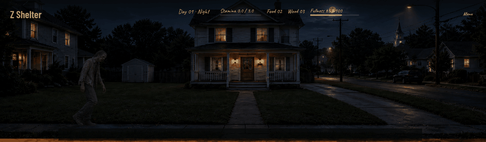
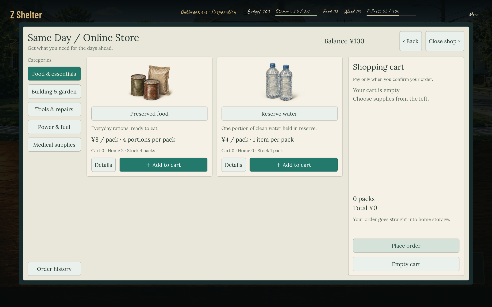
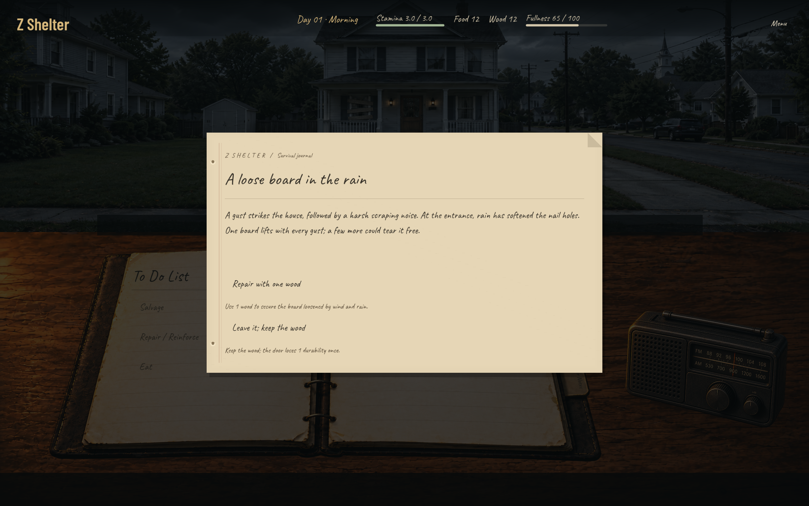

# Z Shelter

[English](README.md) · **简体中文**

**[在 itch.io 查看与试玩](https://alpacewhite.itch.io/z-shelter)** · [反馈与建议](https://github.com/AmethystineAlpaca/z-shelter-public/issues)

  

一款围绕末日前准备、灾后居家求生与选择后果展开的单人生存管理游戏。

灾变前，用有限预算采购物资；灾变后，安排食物和饮水、修补门窗、外出搜刮，并决定如何回应门外的人。有些选择会在之后的日子里留下后果。

## 一眼了解

| 你可以体验什么 | 当前原型 |
| --- | --- |
| 灾变前备货 | 用 100 元预算，在食物、饮水、工具和建材之间取舍 |
| 守住同一栋家 | 修补门窗、分配物资，决定何时冒险外出 |
| 门外的来访者 | 做出选择，看看几天后会留下什么后果 |
| 拆解事件设计 | 阅读 40 个事件、96 个选择的配置，用关系图查看前置条件 |

[▶ 查看约 20 秒预览](https://github.com/AmethystineAlpaca/z-shelter-public/blob/main/assets/forum-preview.mp4) · [查看事件配置说明](CONFIG.zh-CN.md)

预览由当前游戏截图和实机夜间动画拼接而成。

## 关于这个原型

目前已经可以体验准备期和灾后求生，支持中文与英文。开发到这里，我在寻找游戏的核心吸引力上遇到了瓶颈：什么能让人还想继续下一天？所以先把现阶段的试玩版分享出来，欢迎聊聊哪些地方值得继续做、哪里开始无聊，或哪里让你想再玩一天。内容和平衡仍在完善，后续暂无固定更新计划。

## 开始试玩

1. 前往 **[itch.io 下载 macOS 试玩版](https://alpacewhite.itch.io/z-shelter)**。试玩可以免费下载，也可以在下载时自愿付费支持开发。感谢你的试玩和支持！GitHub 不再提供游戏安装包。
2. 完整解压，阅读 **START-HERE-Chinese.txt**，将 **Z Shelter.app** 移到「应用程序」或其他文件夹后打开。无需安装 Godot。
3. 当前版本尚未经过 Apple 公证。如果 macOS 提示无法验证应用，请按随包说明在「系统设置 → 隐私与安全性」允许打开。
4. 首页可切换中文，建议开启新手引导。点击场景物件互动，Esc 返回，F11 全屏。

目前仅提供 macOS 版本，包含 Apple Silicon 与 Intel 可执行文件；启动验证在 Apple Silicon 上完成。暂不提供 Windows、Linux 或手机版。

## 公开配置与事件关系图

本仓库提供当前原型的事件、物品、商城、动作、世界状态、事件投放与平衡配置，供阅读和讨论。其中基础事件包包含 **40 个事件、96 个选择**。这些文件包含剧情剧透。

- [事件包](config/events_vr/registry.json)：事件文本、选择、前置条件与效果。
- [物品](config/registry/items.json) / [商城](config/shop_catalog.json) / [平衡](config/balance.json)。
- [配置说明与查看方法](CONFIG.zh-CN.md)。

可以用我做的 **[Event Graph Reviewer](https://github.com/AmethystineAlpaca/event-graph-reviewer)**，在本地把事件与选项之间的关系展开成图，查看 AND/OR 条件与节点详情。它是只读查看工具，不模拟游戏运行，也不是物品配置编辑器。

## 反馈

欢迎在 [Issues](https://github.com/AmethystineAlpaca/z-shelter-public/issues) 提交玩法建议或问题。报错时请附版本、语言、游戏日数和复现步骤；截图请只包含游戏画面。

这是游戏的公开发布仓库，提供介绍、截图、配置、下载和反馈入口。游戏源码保留在私有仓库，项目并非开源软件。试玩免费，后续版本的发布与定价计划尚未确定。权利说明见 [RIGHTS.md](RIGHTS.md)。

## 支持这个原型

如果这个方向让你感兴趣，欢迎点一个 **Star**，方便以后找到项目；也欢迎把试玩链接分享给喜欢生存管理游戏的朋友。试玩后告诉我“哪次选择让你犹豫”或“从哪一天开始无聊”，会很有帮助。

[免费试玩 / 自愿付费支持](https://alpacewhite.itch.io/z-shelter)。谢谢你愿意看看这个还在摸索中的游戏。
